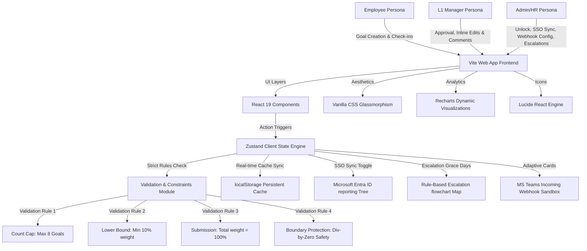

# 🌟 AtomQuest — Enterprise Goal-Setting and Appraisal Portal

AtomQuest is a next-generation corporate appraisal and goal-tracking application. Designed with modern **glassmorphism aesthetics**, smooth animations, and role-based workflows, the platform empowers employees, managers, and HR administrators to align corporate key performance indicators (KPIs), track achievements in real-time, and manage compliance alerts.

---

## 🏗️ Technical Architecture & Design Choices

The platform is designed with a **low-cost, zero-infrastructure-dependency framework**, ensuring immediate scalability and zero runtime database costs.



### 💎 Technology Stack Justification
1. **Frontend Foundation**: React 19 + Vite. Vite enables instantaneous Hot Module Replacement (HMR) and compresses production assets in milliseconds.
2. **State Management**: **Zustand**. A lightweight, hook-based state container that prevents unnecessary virtual DOM re-renders by compiling isolated selector nodes.
3. **Styling**: Vanilla CSS custom variables. Avoids standard layout engines like TailwindCSS to deliver bespoke, ultra-premium visual aesthetics (glassmorphism backdrops, high-contrast text, vibrant system highlights).
4. **Resiliency & Offline Support**: Custom synchronization wrappers linking Zustand stores directly with `localStorage`, providing immediate loading and offline persistence.
5. **Cost Optimization**: All validations, compliance processing, formatting, and organizational tree synchronization run entirely on client-side client resources, meaning **hosting and server computing overhead is exactly $0**.

---

## 🛠️ Role-Based Workflows & User Journeys

The portal is designed around three distinct, secure corporate roles:

### 👤 1. Employee Journey
*   **Goal Sheet Creation**: Access a visual thrust area editor. Create goals by category, select a target UoM (Numeric, %, Timeline, or Zero-Based), and set targets.
*   **Enforced Constraints**:
    *   *Goal Cap*: Blocked from creating more than **8 goals**.
    *   *Min weightage*: Alerts trigger if any goal weightage falls below **10%**.
    *   *Submit rule*: The goal sheet submission remains locked until the total sum of weights equals **exactly 100%**.
*   **Progress Log & Check-in**: Quarterly interfaces enable logging actual values. The computation engine updates progress scores dynamically using UoM-compliant mathematical formulas.
*   **Approval Locks**: Approved goal cards instantly lock down as read-only.

### 👔 2. Manager (L1) Journey
*   **Approvals Panel**: View team members' pending goal sheets. Managers can **edit target values and weightages inline** to match resource constraints.
*   **Approve/Rework Feedbacks**: Click single-button approvals or reject goal sheets back to draft with custom explanatory feedback messages.
*   **Structured Reviews**: Expand team member profiles inside the **Team View** dashboard, review planned-versus-actual achievements, and log structured comments.
*   **KPI Push**: Push corporate KPIs (e.g. `Optimize SQL Query Latency`) with custom default weights. The title and target become read-only for recipient employees, and achievement updates sync back to the manager’s ledger automatically.

### 🛡️ 3. Admin / HR Partner Journey
*   **Goal Reversion & Unlock**: Search approved/completed goals and revert their state back to editable drafts, enabling exception-based edits.
*   **Completion Grid Matrix**: Real-time checklists showing HR exactly who completed goal submissions, manager reviews, and check-ins.
*   **Microsoft Entra ID (SSO) Sync**: Switch SSO enforcement state, view security group role Object GUID maps, and display organization reporting tree structures derived from AD.
*   **MS Teams Webhook Bot**: Customize payload endpoints and test active Teams chat dialog containers. Use inline Adaptive Cards to approve or request goal rework inside the console.
*   **Rule-Based Escalation Panel**: Set grace days thresholds for employees/managers. Recalculate escalations dynamically, trace pathway diagrams, and trigger manual warning chains.
*   **Reports Exporting**: Trigger full corporate CSV spreadsheet reports downloading target vs achievement metrics.

---

## 📸 High-Fidelity Portal Visual Evidence

The following actual high-resolution screenshots were captured from the running application during end-to-end automated browser validation tests:

### 🌐 1. Secure Access & Authentication Portal
A premium glassmorphic access panel with live role-based quick-access seeds for evaluators.


---

### 👤 2. Employee Goal & Check-in Dashboard
Interactive sliders, thrust area categorizations, exact 100% weight validations, and dynamic formula progress cards.


---

### 👔 3. Manager Performance Review & KPI Console
Visual team completion progress curves, inline review adjustment sliders, and structured check-in comment interfaces.


---

### 🛡️ 4. Admin Governance, Entra ID Sync & Teams Webhook Console
Advanced configurations: Active Org Trees, MS Teams Bot sandboxes, rule-based escalation pathway chains, and goal-unlock panels.


---

### 🔄 5. Interactive End-to-End User Journeys Demo (Video/Animation)
Experience the fluid glassmorphism animations and instant responsive validation engines in this actual recorded browser walkthrough.


---

## ⚡ Setup & Local Execution Instructions

### Prerequisites
*   Node.js (v18.x or above)
*   npm

### Installation
1. Clone the repository and navigate to the project directory:
   ```bash
   cd atomquest
   ```
2. Install dependencies:
   ```bash
   npm install
   ```

### Running Locally
*   Start the development server:
    ```bash
    npm run dev
    ```
    *(The portal will launch locally, typically at `http://localhost:5173/` or `http://localhost:5174/`)*
*   Compile a production-ready, highly compressed build bundle:
    ```bash
    npm run build
    ```
*   Preview the production build:
    ```bash
    npm run preview
    ```
